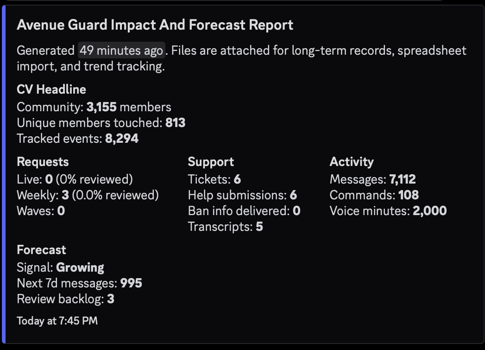
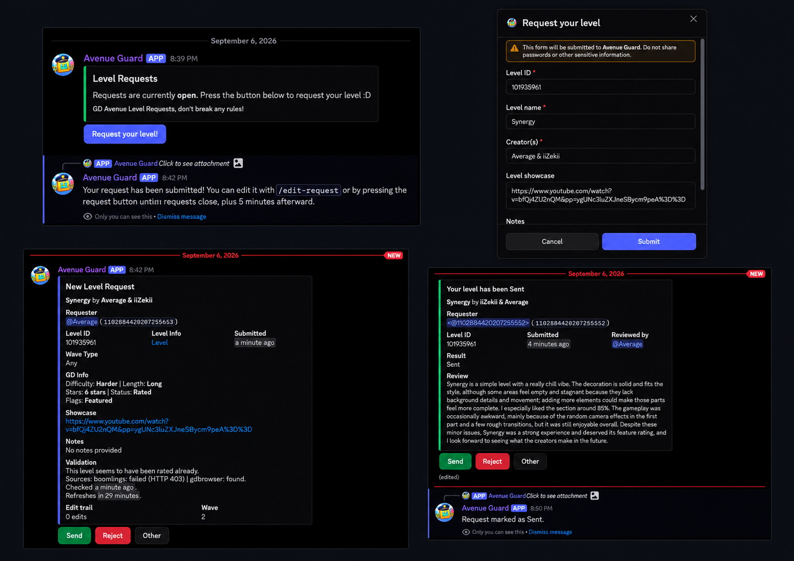
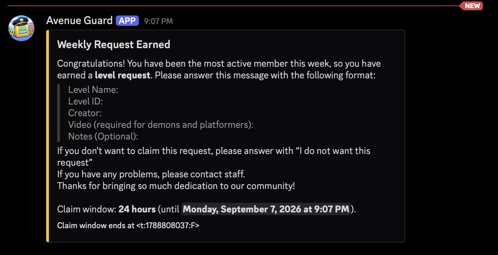
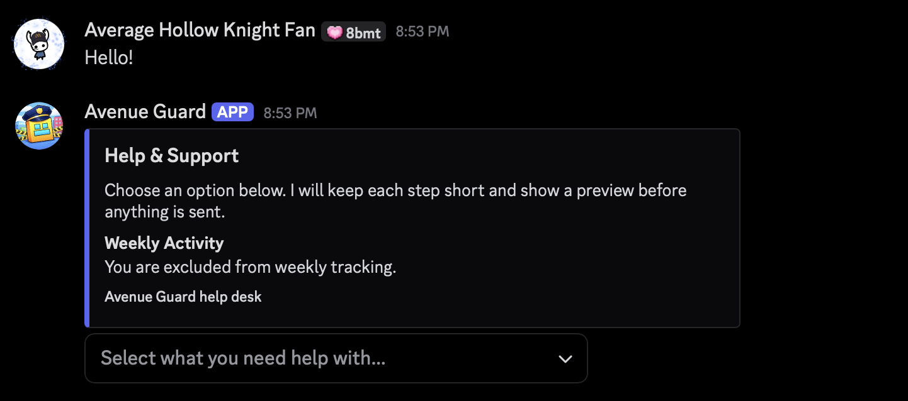
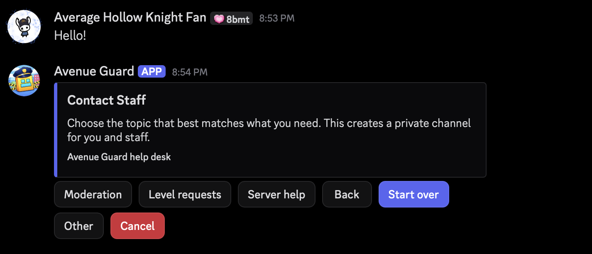
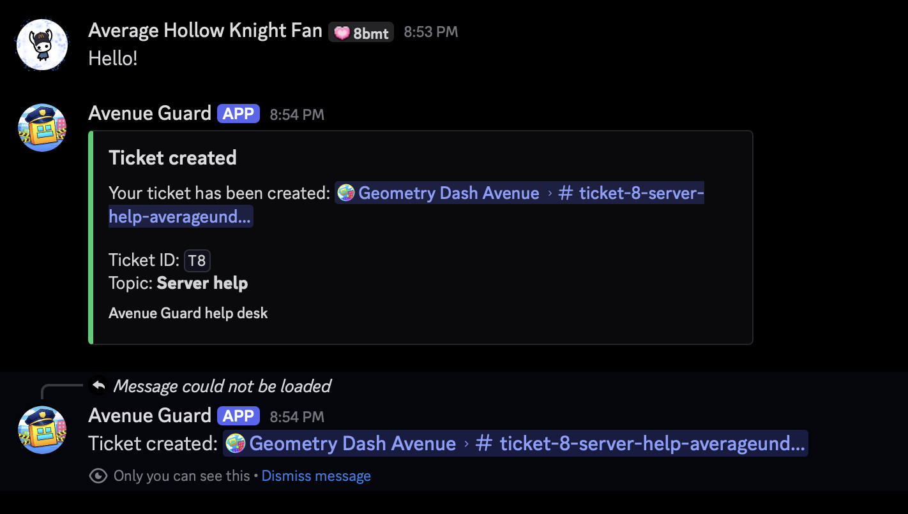
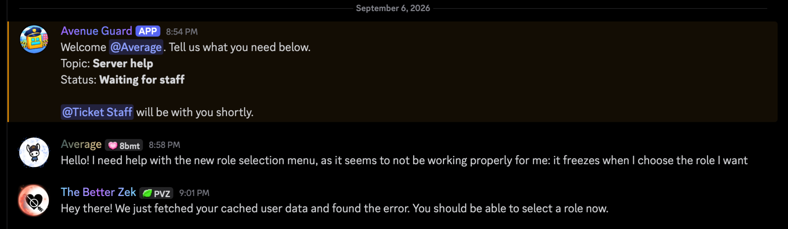
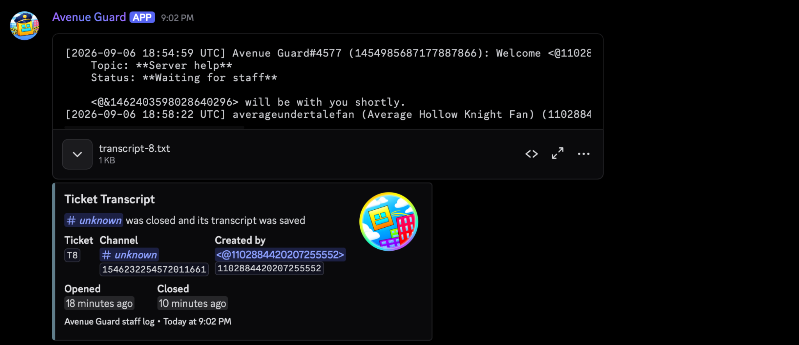
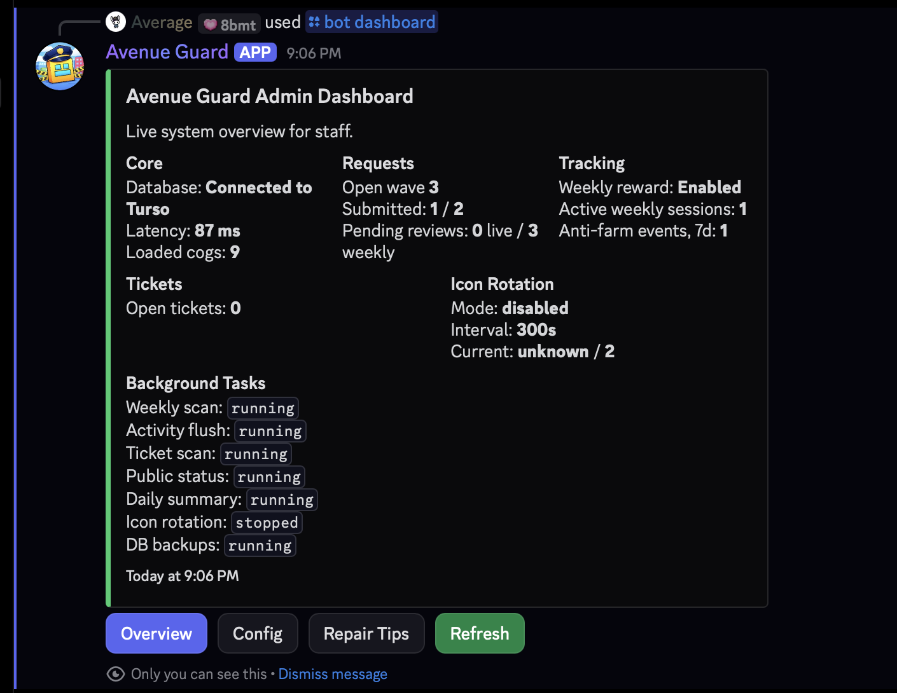
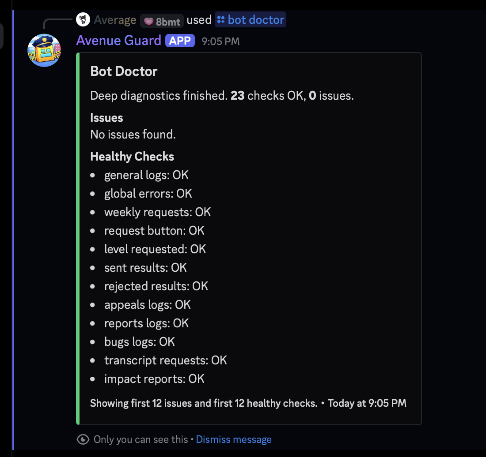

# Avenue Guard

**Production community-operations infrastructure for Geometry Dash Avenue, a 3,155-member Discord community.**

Avenue Guard is a custom system for running long-lived community workflows: level submissions, activity rewards, member support, tickets, forum organization, moderation guardrails, staff operations, recovery, and operational analytics.

**Discord is the interface. The harder problem is state.**

A request can outlive the interaction that created it. A ticket can remain open across deployments. Two reviewers can act at nearly the same time. An external API can fail halfway through validation. A button created yesterday still needs to work after today's restart.

Avenue Guard is built around those problems.

| | |
| --- | --- |
| **Status** | Production · actively maintained |
| **Community** | 3,155 members |
| **Tracked reach** | 813 unique members |
| **Tracked events** | 8,294 |
| **Weekly activity history** | 416 members · 10 weeks |
| **Persistent storage** | Turso / libSQL |
| **Focus** | Reliability · persistent workflows · community operations |



*Production impact snapshot generated by Avenue Guard on September 6, 2026.*

---

## What Avenue Guard does

Avenue Guard started as a way to automate repetitive work inside GD Avenue.

It gradually became a shared operations layer connecting systems that would otherwise have to be handled manually or through several disconnected bots.

### System overview

| System | What Avenue Guard handles |
| --- | --- |
| **Level requests** | Request waves, scheduled openings, structured forms, validation, duplicate protection, editing, review queues and outcomes |
| **Weekly rewards** | Activity tracking, eligibility filtering, anti-farming checks, streak history, private reward claims and weekly requests |
| **Help & support** | FAQ discovery, reports, appeals, bot issues, status information, transcript requests and private staff escalation |
| **Tickets** | Creation, routing, persistent states, assignment/triage, closure, transcripts and satisfaction feedback |
| **Forum organization** | First-message reminders, required-format checks, user notifications, thread cleanup and staff logging |
| **Moderation guardrails** | Narrow channel protections, reaction/message controls, restriction roles and explanatory DMs |
| **Persistence & recovery** | Durable workflow state, persistent components, backups, restore tooling and repair commands |
| **Operations** | Admin dashboard, diagnostics, configuration checks, permission checks and background-task monitoring |
| **Telemetry** | Activity history, request statistics, support metrics, impact reports, trends and machine-readable exports |
| **Community utilities** | Sticky notices, configurable auto-responses, server-icon rotation and smaller interactive commands |

The goal is not maximum automation.

It is to automate the parts of community operations that are **predictable enough to automate reliably**, while leaving decisions that require judgment to people.

---

# Design goals

Avenue Guard has a few principles that now influence most of its design.

### 1. Long-running state should survive restarts

Requests, tickets, reward claims, reviews and scheduled actions should not disappear because the process restarted or the host's local filesystem changed.

### 2. Failure should be recoverable

A temporary API failure, stale Discord object, interrupted task or deployment should not require staff to reconstruct an entire workflow manually.

### 3. Important state changes should be protected

Counters, duplicate checks, request limits, ticket IDs and review transitions should behave correctly even when several users or staff members act at nearly the same time.

### 4. Automation should reduce work, not remove judgment

Avenue Guard can validate data, enforce known rules, route work and surface warnings.

It does not try to replace staff decisions where context matters.

### 5. The system should explain what it is doing

Important actions leave logs or audit records, and staff have tools to inspect configuration, workflow state and system health.

---

# Core systems

## Level request orchestration

One of Avenue Guard's largest systems manages Geometry Dash level submissions from opening a request window to the final staff decision.

Staff can open request waves:

- for a fixed number of successful submissions;
- for a specific amount of time;
- indefinitely;
- or through a scheduled opening.

A slot is consumed only after a form is successfully submitted. Merely pressing the request button does not waste one.

Members submit structured information through Discord components rather than free-form messages.

The request system then handles:

- one submission per member per wave;
- duplicate level-ID protection;
- configurable request limits;
- limited editing after submission;
- scheduled openings;
- pending-request checks;
- level metadata retrieval;
- showcase requirements;
- persistent staff review;
- explicit review outcomes;
- and request edit/review history.

### External validation

Before a request reaches staff, Avenue Guard can validate the level against external Geometry Dash data providers.

The validation layer can check whether the level exists, retrieve metadata, identify already-rated levels and surface information that may need extra review.

It is also designed around unreliable dependencies.

Caching, retries, cooldowns, provider backoff and fallback behaviour prevent one unavailable service from automatically breaking the entire request workflow.

The example below captures that directly: one provider returns **HTTP 403** while the fallback provider successfully supplies the level.



*One request moving from an open wave through structured submission, external validation and staff review.*

---

## Weekly activity rewards

Avenue Guard runs a separate system for rewarding sustained community participation.

The activity pipeline roughly follows three stages:

1. exclude configured channels and roles;
2. filter known activity-farming patterns;
3. store eligible activity in weekly history.

The result is not simply a raw message leaderboard.

The system keeps longitudinal activity data and can recognize members who remain consistently active across multiple weeks.

Qualifying members can receive a private weekly level-request opportunity with a limited claim window.



Weekly rewards remain separate from normal public request waves, but once claimed, the resulting submission can enter the same broader review infrastructure.

The latest production snapshot included:

- **416 members** with tracked weekly activity;
- **10 weeks** of activity history;
- **6 reward claim records**;
- **59 weekly DM log events**;
- tracked streaks;
- and anti-farm events.

---

## Member help, reports and appeals

Avenue Guard also acts as the private entry point for several member-support workflows.

Members can use its DM interface to:

- search FAQ entries;
- check basic status information;
- submit an appeal;
- report another member;
- report a bot problem;
- request eligible transcripts;
- obtain ban-related information where applicable;
- or contact staff directly.

The help flow can suggest relevant FAQ information before escalating a question, reducing unnecessary staff pings while still providing a route to a person when needed.



Requests that need a person can be categorized before escalation:



---

## Stateful ticket system

When private staff assistance is required, Avenue Guard can create a dedicated support channel and convert the help request into a tracked ticket.



Tickets use explicit workflow states such as:

`Waiting for staff` → `Waiting for user` → `Resolved`

This gives staff an actual queue and lifecycle rather than a collection of temporary channels with no shared state.

Avenue Guard can track and support:

- ticket IDs;
- topics;
- status transitions;
- staff/user waiting state;
- closure;
- transcript generation;
- later review;
- and satisfaction feedback.

A real support interaction:



When the ticket closes, Avenue Guard saves a transcript before the temporary channel is removed:



The latest production snapshot recorded:

| Support metric | Value |
| --- | ---: |
| Tickets opened | **6** |
| Tickets resolved | **6** |
| Saved transcripts | **5** |
| Average resolution time | **12.76 hours** |
| Separate help submissions | **6** |

---

## Forum and message organization

A large server creates another kind of repetitive work: keeping instructions visible and keeping structured channels actually structured.

Avenue Guard includes tools for this as well.

### Sticky notices

Selected channels can maintain recurring or sticky instructions so important information does not disappear far above the current conversation.

### Forum reminders

When a new forum thread is created, Avenue Guard can post the appropriate first-message instructions.

### Required-format enforcement

Some forum areas require a particular marker, word or format.

Avenue Guard can:

1. check the initial post;
2. notify the author privately if the requirement is missing;
3. remove the invalid thread when configured;
4. and record what happened for staff.

This is particularly useful in areas such as collaboration channels where the same formatting problems otherwise create repeated manual work.

---

## Moderation guardrails

Avenue Guard is **not primarily a moderation bot**, but it includes narrowly scoped protections for recurring situations where the correct action is predictable.

Examples include:

- watching channels where only specific users should interact;
- removing unauthorized messages;
- removing unauthorized reactions;
- applying configured restriction roles;
- sending a DM explaining why a restriction was applied;
- and logging the event.

These checks are intentionally narrow.

The point is to automate clear-cut cases without trying to automate ambiguous moderation decisions.

---

# Reliability and persistence

This is the part of Avenue Guard that grew most as the project moved from "bot" to production system.

## Turso / libSQL

Production state is stored through **Turso/libSQL**.

The system keeps SQLite-compatible development and access patterns while synchronizing important state to durable remote storage instead of depending entirely on a host's temporary local filesystem.

Avenue Guard uses a local embedded replica for fast local access while keeping the production source of truth durable.

Persistent data includes areas such as:

- request waves;
- level submissions;
- reviews;
- weekly activity;
- reward claims;
- help submissions;
- tickets;
- transcripts;
- scheduled openings;
- validation cache;
- backup metadata;
- restore history;
- and impact snapshots.

The database layer also performs startup checks and includes handling for temporary sync failures and unusable local storage paths.

---

## Protected state changes

Several workflows have operations where race conditions matter.

For example:

- two members should not consume the same final request slot;
- duplicate submissions should not slip through simultaneous checks;
- ticket IDs should remain unique;
- and two reviewers should not independently finalize the same request state.

Avenue Guard therefore treats important counters and transitions as protected state updates rather than simple message actions.

---

## Persistent Discord components

Discord buttons and menus may remain visible long after the process that created them has restarted.

Avenue Guard registers persistent components again during startup so older:

- request buttons;
- review controls;
- ticket controls;
- and help menus

can continue routing to the workflow they belong to after deployments and restarts.

---

## Pre-action validation

Important actions are checked before they are allowed to modify state.

Depending on the workflow, Avenue Guard can validate:

- roles;
- channels;
- permissions;
- request state;
- level IDs;
- URLs;
- duplicate submissions;
- configuration;
- and required Discord objects.

The intention is to catch predictable failures before they become corrupted workflow state.

---

# Recovery and operational tooling

Production systems need ways to answer two questions:

> **What is wrong?**

and

> **How do we recover?**

Avenue Guard includes staff tooling for both.

## Live admin dashboard



The dashboard exposes live information including:

- Turso connectivity;
- database latency;
- loaded feature modules;
- request-wave status;
- pending reviews;
- open tickets;
- weekly tracking state;
- anti-farm events;
- and background-task status.

## Bot Doctor

A separate diagnostic system performs deeper checks across configured production workflows.



The run shown above completed **23 checks with 0 issues**, including checks across request infrastructure, logs, reports and transcripts.

The value of Bot Doctor is not the green screenshot itself.

It is having a repeatable diagnostic path when something is *not* green.

---

## Recovery and repair commands

Staff tooling can also perform or assist with recovery operations such as:

- refreshing request buttons;
- rebuilding summaries;
- relocking reviewed requests;
- checking database/storage state;
- validating configuration;
- diagnosing missing permissions;
- creating backups;
- and restoring compatible uploaded local database copies when using local SQLite.

---

## Backup flow

Backups form a second safety layer around the production database.

The system can create zipped database backups and maintain records of backup and restore activity.

Where local restoration is applicable, Avenue Guard can validate an uploaded database copy, migrate restored data where necessary and record the recovery operation.

The September 6 production snapshot contained **114 recorded database backups**.

---

# Auditability and safety controls

Avenue Guard keeps records for many operations where later reconstruction can matter.

Audit/logging coverage includes areas such as:

- request edits;
- review results;
- weekly reward events;
- ticket transcripts;
- forum removals;
- administrative actions;
- backups;
- restores;
- and impact-report generation.

Rate limits and cooldowns are also applied to systems where repeated interactions could create spam or accidental overload, including:

- activity tracking;
- help flows;
- external validation;
- auto-responses;
- and smaller interactive commands.

---

# Configuration

Avenue Guard is specific to GD Avenue, but it is not built by scattering server IDs and behaviour throughout every feature.

A central configuration layer controls things such as:

- channels;
- roles;
- permissions;
- request behaviour;
- help text;
- embeds;
- summaries;
- backups;
- and where different logs are sent.

This lets server behaviour change without requiring the underlying workflow logic to be rewritten each time.

The system can also scan for configuration problems including:

- missing channels;
- missing roles;
- invalid template variables;
- broken permissions;
- and unhealthy background tasks.

---

# Telemetry and impact reporting

Avenue Guard does not rely only on anecdotal usage to determine whether its systems are being used.

It collects operational telemetry for the workflows it manages and can generate a combined **Impact and Forecast Report**.

The latest snapshot recorded:

| Metric | Value |
| --- | ---: |
| Community members | **3,155** |
| Unique members touched by tracked workflows | **813** |
| Tracked interaction events | **8,294** |
| Tracked messages | **7,112** |
| Reactions recorded | **871** |
| Slash commands recorded | **108** |
| Voice activity recorded | **2,000 minutes** |
| Members with tracked weekly activity | **416** |
| Weekly history | **10 weeks** |
| Database backups | **114** |
| 30-day command error rate | **0.0%** |
| Current engagement signal | **Growing** |

`8,294 tracked interaction events` does **not** mean 8,294 commands.

The metric combines activity recorded by the workflows and telemetry systems Avenue Guard monitors.

### Machine-readable exports

An impact run can produce the same snapshot as:

- Markdown;
- summary CSV;
- daily-trend CSV;
- breakdown CSV;
- and raw JSON.

This makes the telemetry usable outside Discord for spreadsheets, charts, longitudinal comparisons and future portfolio reporting.

---

# Smaller systems and quality-of-life features

Not every useful feature needs its own architecture section.

Avenue Guard also includes:

- configurable message-triggered auto-responses;
- recurring/sticky channel notices;
- server icon rotation;
- member-created artwork in the icon rotation;
- background summaries;
- smaller community/fun commands;
- configurable role-notification DMs;
- and staff-facing logging across its major systems.

Several of the community-facing features originated from member requests or polls rather than the original project plan.

That is part of the design goal: Avenue Guard should be dependable infrastructure, but it should still feel like it belongs to the community using it.

---

# Architecture

Avenue Guard is a modular Discord application rather than a single large command file.

```text
                         Discord
             events · commands · buttons · modals
                            │
                            ▼
                    Feature workflows
       ┌────────────────────┼────────────────────┐
       ▼                    ▼                    ▼
    Requests             Support             Tracking
   & reviews             & tickets           & rewards
       │                    │                    │
       └────────────────────┼────────────────────┘
                            │
             forums · moderation · jobs
                            │
                            ▼
                     Shared services
       validation · configuration · transcripts
            persistence · logging · diagnostics
                            │
               ┌────────────┴────────────┐
               ▼                         ▼
         Turso / libSQL            External services
               │
               ▼
          Durable workflow state
